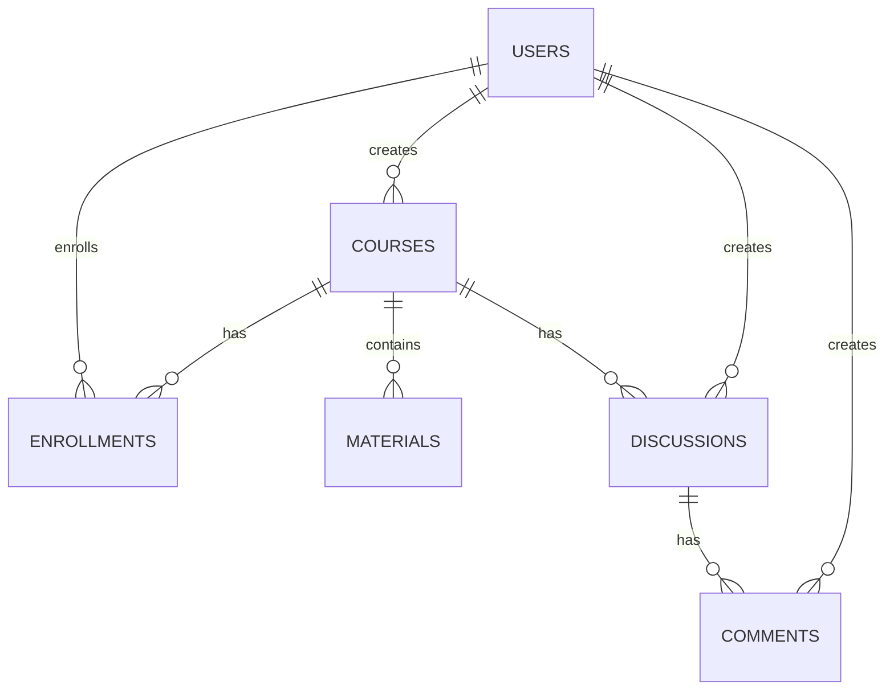

# 🎓 课程资料分享平台

<div align="center">


一个功能完善的在线学习管理系统，支持课程创建、资料分享、讨论互动等核心功能

[在线演示](#) • [快速开始](#快速开始) • [功能特性](#核心功能) • [部署文档](#云服务部署)

</div>

---

## ✨ 项目简介

本平台是一个基于 **React + Node.js + MySQL** 构建的现代化在线学习管理系统，旨在为教育机构和学习社区提供便捷的课程管理、资料分享和互动讨论服务。

### 🎯 设计理念

- **简洁优雅**: 采用现代化的 UI 设计，提供流畅的用户体验
- **功能完整**: 覆盖课程管理全流程，从创建到互动一站式服务
- **安全可靠**: JWT 认证、权限控制、数据加密等多重安全保障
- **易于部署**: 支持 Docker 容器化部署，快速上线

---

## 🚀 核心功能

### 👤 用户管理
- ✅ 用户注册/登录（邮箱验证）
- ✅ JWT 身份认证
- ✅ 角色权限管理（学生/管理员）
- ✅ 所有用户均可创建课程
- ✅ 个人中心（头像、资料、密码管理）
- ✅ 管理员用户管理功能

### 📚 课程管理
- ✅ 课程创建与编辑（支持所有用户）
- ✅ 课程浏览与搜索
- ✅ 分类筛选（24个学科分类）
- ✅ 课程加入/退出
- ✅ 我的课程（创建+加入的课程聚合展示）
- ✅ 课程详情（成员、资料、讨论统计）

### 📁 资料分享
- ✅ 多格式文件上传（PDF、PPT、DOC、图片、视频等）
- ✅ 文件分类管理
- ✅ 下载次数统计
- ✅ 文件预览功能
- ✅ 存储容量控制

### 💬 讨论互动
- ✅ 课程讨论区（每门课程独立）
- ✅ 发布讨论主题
- ✅ 评论与回复（支持多级评论）
- ✅ 点赞功能
- ✅ 非成员可浏览内容

### 🎨 界面特色
- ✅ 响应式设计，支持多端访问
- ✅ Ant Design 组件库，美观易用
- ✅ 首页数据统计展示
- ✅ 优雅的加载状态与错误提示

---

## 🛠️ 技术栈

### 前端技术
| 技术 | 版本 | 说明 |
|------|------|------|
| React | 18.3+ | 前端框架 |
| TypeScript | 5.0+ | 类型安全 |
| Ant Design | 5.x | UI 组件库 |
| React Router | 6.x | 路由管理 |
| Zustand | 4.x | 状态管理 |
| Axios | 1.x | HTTP 客户端 |
| Vite | 5.x | 构建工具 |

### 后端技术
| 技术 | 版本 | 说明 |
|------|------|------|
| Node.js | 18.17+ | 运行环境 |
| Express | 4.x | Web 框架 |
| MySQL2 | 3.x | 数据库驱动 |
| JWT | - | 身份认证 |
| Bcrypt | - | 密码加密 |
| Multer | - | 文件上传 |

### 数据库设计
- **MySQL 8.0**: 关系型数据库
- **8张核心表**: users, courses, enrollments, materials, discussions, comments, likes, download_logs
- **软删除机制**: 保证数据安全
- **索引优化**: 提升查询性能

---

## 📦 项目结构

```
course-materials-sharing-platform/
├── backend/                      # 后端服务
│   ├── src/
│   │   ├── controllers/          # 控制器层
│   │   │   ├── auth.controller.js
│   │   │   ├── user.controller.js
│   │   │   ├── course.controller.js
│   │   │   ├── material.controller.js
│   │   │   └── discussion.controller.js
│   │   ├── models/              # 数据模型层
│   │   │   ├── user.model.js
│   │   │   ├── course.model.js
│   │   │   └── material.model.js
│   │   ├── routes/              # 路由定义
│   │   ├── middlewares/         # 中间件
│   │   │   ├── auth.js         # JWT认证
│   │   │   ├── upload.js       # 文件上传
│   │   │   └── errorHandler.js # 错误处理
│   │   ├── utils/               # 工具函数
│   │   └── app.js               # 应用入口
│   ├── package.json
│   └── .env.example             # 环境变量示例
│
├── frontend/                     # 前端应用
│   ├── src/
│   │   ├── components/          # 通用组件
│   │   │   └── layout/
│   │   │       └── MainLayout.tsx
│   │   ├── pages/              # 页面组件
│   │   │   ├── home/           # 首页
│   │   │   ├── auth/           # 登录注册
│   │   │   ├── course/         # 课程相关
│   │   │   ├── profile/        # 个人中心
│   │   │   └── admin/          # 管理后台
│   │   ├── services/           # API服务
│   │   ├── store/              # 状态管理
│   │   ├── types/              # TypeScript类型
│   │   └── App.tsx
│   ├── package.json
│   └── vite.config.ts
│
├── docs/                        # 项目文档
│   ├── 01-架构设计.md
│   ├── 02-数据库设计.md
│   ├── 03-API设计.md
│   └── ...
│
├── docker/                      # Docker配置
│   └── docker-compose.yml
│
├── start-dev.bat                # Windows启动脚本
├── start-dev.sh                 # Linux/Mac启动脚本
└── README.md
```

---

## 🎬 快速开始

### 前置要求

确保你的开发环境已安装以下工具：

- **Node.js**: 18.17.0 或更高版本
- **MySQL**: 8.0 或更高版本
- **Git**: 最新版本
- **npm** 或 **yarn**: 包管理工具

### 1️⃣ 克隆项目

```bash
git clone https://github.com/aikunkun9527/Course-materials-sharing-platform.git
cd Course-materials-sharing-platform
```

### 2️⃣ 数据库配置

```bash
# 启动 MySQL 数据库
# Windows: 使用 MySQL Workbench 或命令行
# Linux/Mac:
sudo systemctl start mysql

# 创建数据库
mysql -u root -p
```

在 MySQL 中执行：

```sql
CREATE DATABASE course_sharing_platform CHARACTER SET utf8mb4 COLLATE utf8mb4_unicode_ci;
USE course_sharing_platform;

-- 导入数据库表结构（参考 docs/02-数据库设计.md）
```

### 3️⃣ 后端配置

```bash
cd backend

# 安装依赖
npm install

# 复制环境变量配置文件
cp .env.example .env

# 编辑 .env 文件，配置数据库连接等信息
# NODE_ENV=development
# PORT=8080
# DB_HOST=localhost
# DB_PORT=3306
# DB_NAME=course_sharing_platform
# DB_USER=root
# DB_PASSWORD=your_password
# JWT_SECRET=your_secret_key

# 初始化数据库表（如果有SQL脚本）
# mysql -u root -p course_sharing_platform < scripts/init.sql

# 启动后端服务
npm run dev
```

后端服务将在 `http://localhost:8080` 启动

### 4️⃣ 前端配置

```bash
cd frontend

# 安装依赖
npm install

# 启动前端开发服务器
npm run dev
```

前端应用将在 `http://localhost:5173` 启动

### 5️⃣ 访问应用

打开浏览器访问：`http://localhost:5173`

**默认测试账号**：
- 管理员：admin@example.com / 123456
- 学生：student@example.com / 123456

---

## 📸 功能截图

> 这里可以添加项目截图

---

## 📚 API 文档

### 认证接口

| 接口 | 方法 | 描述 |
|------|------|------|
| `/api/v1/auth/register` | POST | 用户注册 |
| `/api/v1/auth/login` | POST | 用户登录 |
| `/api/v1/auth/logout` | POST | 用户登出 |
| `/api/v1/auth/refresh` | POST | 刷新Token |

### 课程接口

| 接口 | 方法 | 描述 |
|------|------|------|
| `/api/v1/courses` | GET | 获取课程列表 |
| `/api/v1/courses/:id` | GET | 获取课程详情 |
| `/api/v1/courses` | POST | 创建课程 |
| `/api/v1/courses/:id` | PUT | 更新课程 |
| `/api/v1/courses/:id/join` | POST | 加入课程 |
| `/api/v1/courses/my` | GET | 我的课程 |

### 用户接口

| 接口 | 方法 | 描述 |
|------|------|------|
| `/api/v1/users/profile` | GET | 获取个人信息 |
| `/api/v1/users/profile` | PUT | 更新个人信息 |
| `/api/v1/users/avatar` | POST | 上传头像 |
| `/api/v1/users/password` | PUT | 修改密码 |

详细 API 文档请查看：[docs/03-API设计.md](./docs/03-API设计.md)

---

## 🐳 Docker 部署

### 使用 Docker Compose

```bash
# 启动所有服务
docker-compose up -d

# 查看日志
docker-compose logs -f

# 停止服务
docker-compose down
```

### 单独构建镜像

```bash
# 构建后端镜像
docker build -t course-platform-backend ./backend

# 构建前端镜像
docker build -t course-platform-frontend ./frontend
```

---

## ☁️ 云服务部署

本平台支持部署到阿里云轻量应用服务器：

### 部署选项

1. **阿里云轻量应用服务器** - 推荐方案
   - 配置: 2核2G Ubuntu
   - 适合中小型应用
   - 成本低,易维护
   - 详细部署指南: [DEPLOY_LIGHTWEIGHT_SERVER.md](./DEPLOY_LIGHTWEIGHT_SERVER.md)
   - 快速开始: [QUICK_START_SERVER.md](./QUICK_START_SERVER.md)

2. **其他云服务**
   - 腾讯云轻量应用服务器
   - AWS EC2
   - 自建服务器

### 部署控制台

- 阿里云轻量应用服务器: https://swasnext.console.aliyun.com/servers/cn-shenzhen

详细部署指南请参考：[docs/06-部署指南.md](./docs/06-部署指南.md)

---

## 🗄️ 数据库设计

### 核心数据表

| 表名 | 说明 | 字段数 |
|------|------|--------|
| users | 用户表 | 12 |
| courses | 课程表 | 10 |
| enrollments | 选课记录表 | 6 |
| materials | 资料表 | 9 |
| discussions | 讨论表 | 8 |
| comments | 评论表 | 7 |

### ER 图



详细数据库设计请查看：[docs/02-数据库设计.md](./docs/02-数据库设计.md)

---

## 🔧 环境变量说明

### 后端环境变量 (.env)

```bash
# 应用配置
NODE_ENV=production          # 运行环境
PORT=8080                    # 服务端口

# 数据库配置
DB_HOST=localhost            # 数据库主机
DB_PORT=3306                 # 数据库端口
DB_NAME=course_sharing_platform  # 数据库名称
DB_USER=root                 # 数据库用户
DB_PASSWORD=your_password    # 数据库密码

# JWT配置
JWT_SECRET=your_secret_key   # JWT密钥
JWT_EXPIRES_IN=7d            # Token过期时间

# 文件上传配置
UPLOAD_MAX_SIZE=10485760     # 最大文件大小 (10MB)
UPLOAD_ALLOWED_TYPES=pdf,doc,docx,ppt,pptx,txt,jpg,jpeg,png,gif,mp4

# CORS配置
CORS_ORIGIN=http://localhost:5173  # 允许的前端域名
```

---

## 📖 开发指南

### 代码规范

- **前端**: 遵循 ESLint + Prettier 配置
- **后端**: 使用 Airbnb JavaScript Style Guide
- **提交信息**: 使用 Conventional Commits 规范

### 分支策略

- `main` - 主分支，稳定版本
- `develop` - 开发分支
- `feature/*` - 功能分支
- `bugfix/*` - 修复分支
- `hotfix/*` - 紧急修复分支

### 提交规范

```bash
# 功能开发
git commit -m "feat: 添加课程搜索功能"

# Bug修复
git commit -m "fix: 修复用户头像上传失败的问题"

# 文档更新
git commit -m "docs: 更新README部署说明"

# 样式修改
git commit -m "style: 统一前端组件命名规范"
```

---

## 🤝 贡献指南

欢迎任何形式的贡献！

### 如何贡献

1. Fork 本仓库
2. 创建你的特性分支 (`git checkout -b feature/AmazingFeature`)
3. 提交你的更改 (`git commit -m 'feat: Add some AmazingFeature'`)
4. 推送到分支 (`git push origin feature/AmazingFeature`)
5. 开启一个 Pull Request

### 报告问题

如果你发现了 bug 或有新的功能建议，请：

1. 搜索现有的 [Issues](../../issues)
2. 如果没有找到相关问题，创建新的 Issue
3. 详细描述问题或功能需求
4. 提供重现步骤或设计草图

---

## 📄 许可证

本项目采用 [MIT](LICENSE) 许可证。

```
Copyright (c) 2024-present
```

---

## 📞 联系方式

如有问题或建议，欢迎通过以下方式联系：

- 📧 Email: [3273139633@qq.com](mailto:3273139633@qq.com)
- 🐙 GitHub: [@aikunkun9527](https://github.com/aikunkun9527)
- 💬 Issues: [提交问题](../../issues)

---

## 🌟 致谢

感谢以下开源项目和贡献者：

- [React](https://react.dev/)
- [Ant Design](https://ant.design/)
- [Express](https://expressjs.com/)
- [MySQL](https://www.mysql.com/)

---

<div align="center">

**⭐ 如果这个项目对你有帮助，请给个 Star 支持一下！**

Made with ❤️ by [aikunkun9527](https://github.com/aikunkun9527)

</div>
